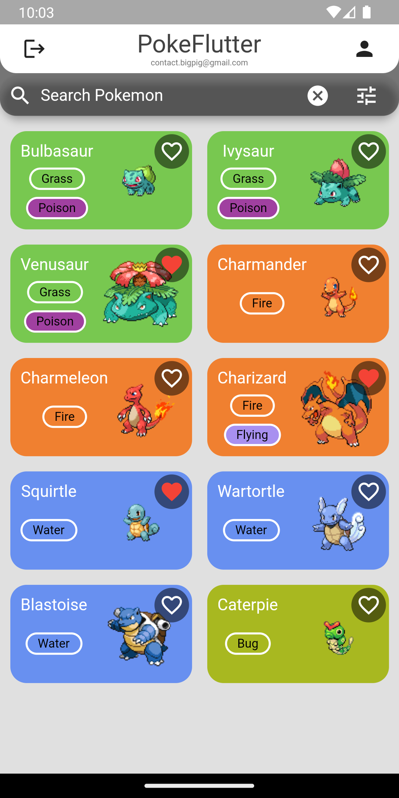

# PokeFlutter
Aplicación android con flutter ([GetX](https://pub.dev/packages/get)) consumiendo la api [PokeApi](https://pokeapi.co/) y como base de datos FireBase (Auth y FireStore).

## Descripción
La aplicación cuenta con un login con correo y contraseña, registro con correo y contraseña, inicio de sesión con Google, una pantalla principal con un listado de pokemones y una pantalla donde se mustran los favoritos del usuario.

## Screenshots

 
 

