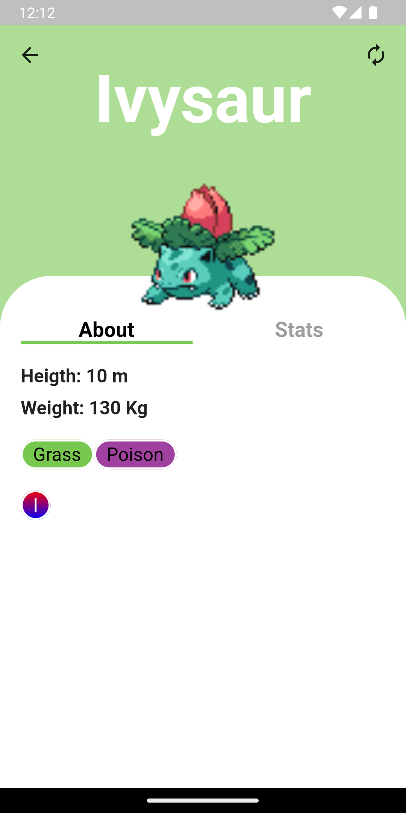
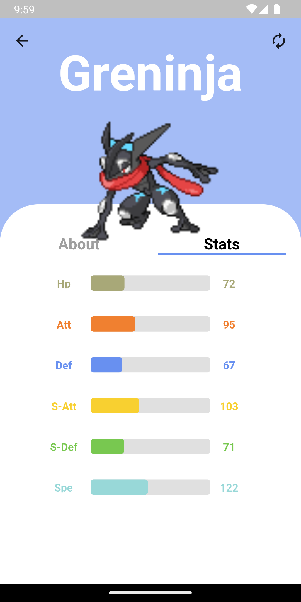
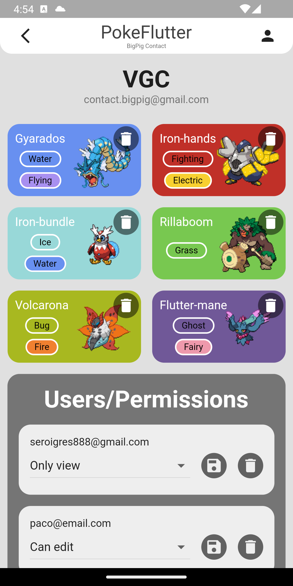

# PokeFlutter

Aplicación android con flutter ([GetX](https://pub.dev/packages/get)) consumiendo la api [PokeApi](https://pokeapi.co/) y como base de datos FireBase (Auth y FireStore).

## Descripción

La aplicación cuenta con un login con correo y contraseña, registro con correo y contraseña, inicio de sesión con Google.

Una pantalla principal con un listado de pokemones donde puedes filtrar por diferentes tipos de filtros(tipos, generación, estadisticas...).

Una pestaña donde se encuntran los favoritos del usuario, una pestaña donde muestra estadisticas sobre los favoritos del usuario, una pantalla para las notificaciónes (invitaciones a equipos).

Una ventana donde estan los equipos del usuario (propios e invitados)...

## Screenshots

<table>
  <tr>
    <td>Login | Home | User Favorites</td>
  </tr>
  <tr>
    <td valign="top"></td>
    <td valign="top"></td>
    <td></td>
  </tr>
  <tr>
    <td>More Info & Stats:</td>
  </tr>
  <tr>
    <td></td>
    <td></td>
  </tr>
  <tr>
    <td>Filters:</td>
  </tr>
  <tr>
    <td></td>
    <td></td>
  </tr>
  <tr>
    <td>User Data:
  </tr>
  <tr>
    <td></td>
    <td></td>
    <td></td>
  </tr>
  <tr>
    <td>Teams:
  </tr>
    <tr>
    <td></td>
    <td></td>
    <td></td>
  </tr>
  </tr>
    <tr>
    <td></td>
    <td></td>
  </tr>
</table>
